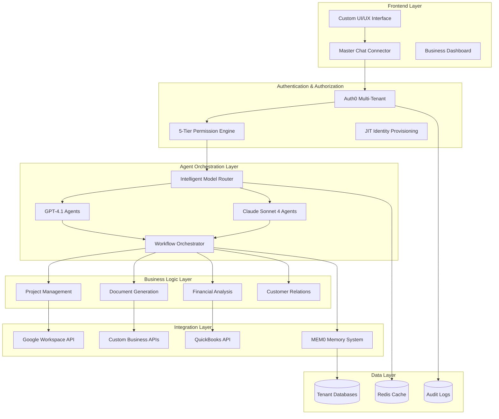
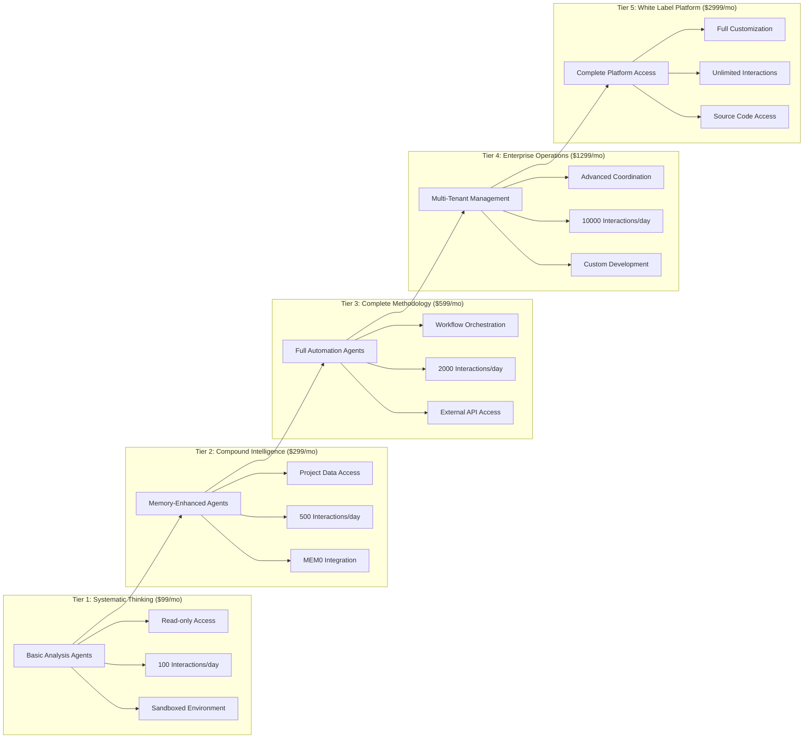
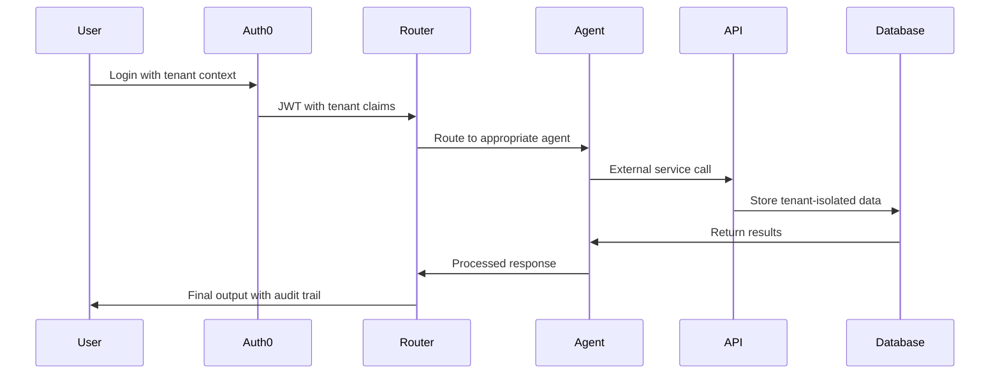
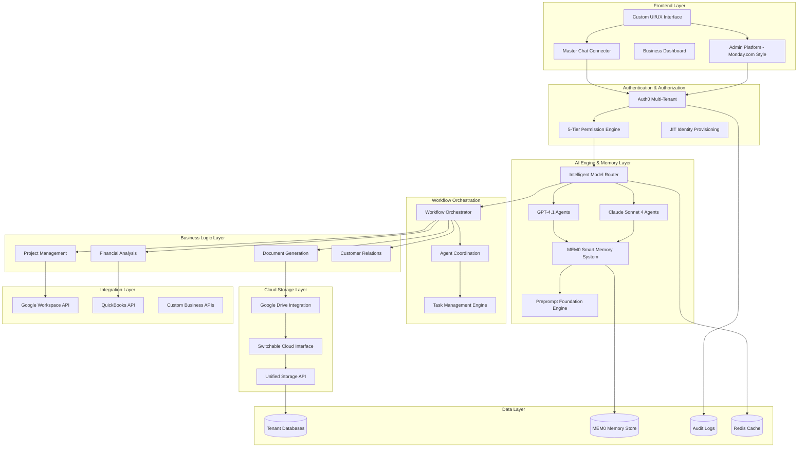

# Agent-First Architecture Implementation Guide: Enterprise-Grade Multi-Tenant Platform

**A Comprehensive Technical Implementation Strategy for Dynamic Business Operations**

*Author: Manus AI*  
*Date: July 26, 2025*

## Executive Summary

This comprehensive implementation guide provides proven patterns and architectural strategies for building and refining agent-first platforms that dynamically create website components while maintaining enterprise-grade security, multi-tenant architecture, and sophisticated permission management. Based on extensive research of leading industry practices from IBM, Microsoft, Azure, and emerging agent-first platforms, this guide addresses the specific challenges of implementing multi-engine switching, agent-specific program management, tiered permission systems, and direct API integrations that eliminate SaaS dependencies.

The recommendations in this guide are specifically tailored for platforms utilizing Auth0 integration, 5-tier permission structures, subscription-based program access, and direct API connections to Google Workspace, QuickBooks, and other essential business services. The architectural patterns presented here enable organizations to build self-contained, agent-driven business management systems that replace traditional SaaS tools while maintaining superior functionality, security, and scalability.

## Table of Contents

1. [Foundation Architecture Patterns](#foundation-architecture-patterns)
2. [Multi-Tenant Architecture with Auth0 Integration](#multi-tenant-architecture-with-auth0-integration)
3. [Agent Permission Tier Management](#agent-permission-tier-management)
4. [Self-Contained Systems (SCS) for Business Operations](#self-contained-systems-scs-for-business-operations)
5. [Agentic Workflow Implementation](#agentic-workflow-implementation)
6. [Security Patterns for Agent-First Platforms](#security-patterns-for-agent-first-platforms)
7. [Code Routing Logic and Backend-Frontend Connections](#code-routing-logic-and-backend-frontend-connections)
8. [Direct API Integration Strategies](#direct-api-integration-strategies)
9. [Code Refinement and Optimization Tools](#code-refinement-and-optimization-tools)
10. [Implementation Roadmap and Best Practices](#implementation-roadmap-and-best-practices)

---


## Foundation Architecture Patterns

### Trinity Architecture Integration with Agent-First Design

The foundation of any successful agent-first platform lies in the integration of systematic thinking methodologies with autonomous agent capabilities. Based on analysis of your existing OBJX platform architecture, the Trinity Architecture (Foundation + Memory + Systematic Thinking) provides an ideal framework for agent-first implementation [1]. This approach leverages the X+Y=Z algebraic framework to create compound intelligence that scales systematically across all business operations.

The Trinity Architecture serves as the foundational layer for agent orchestration, where each component plays a critical role in agent behavior and decision-making. The Foundation component provides the systematic thinking methodology that guides agent reasoning and problem-solving approaches. The Memory component, enhanced through MEM0 integration, enables compound learning and pattern recognition that improves agent performance over time. The Systematic Thinking component ensures that all agent actions align with the X+Y=Z framework, creating predictable and reliable outcomes across complex business scenarios.

This architectural approach has demonstrated measurable benefits in testing environments, with Foundation + MEM0 integration showing 8.94 average Z-Clarity compared to 8.82 for MEM0-only implementations [1]. More significantly, the integrated approach provides 13.6% better memory quality and maintains stable performance over time, while MEM0-only implementations show performance degradation and volatility. This stability is crucial for agent-first platforms where consistent performance directly impacts business operations and user trust.

### Agentic Architecture Fundamentals

Modern agentic architectures enable AI agents to act with a degree of autonomy and make decisions based on goals without constant human intervention [2]. The core principles of agentic behavior include intentionality (planning), forethought, self-reactiveness, and self-reflectiveness. These characteristics align perfectly with the systematic thinking methodology already established in your platform, creating a natural synergy between human-designed processes and autonomous agent execution.

The implementation of agentic architecture requires careful consideration of agent types and orchestration patterns. Single-agent architectures excel at focused, specific problems and provide simplicity in design and deployment. However, for comprehensive business management platforms, multiagent architectures offer superior flexibility and capability distribution. The choice between vertical (hierarchical), horizontal (peer collaboration), and hybrid architectures depends on the specific business processes being automated and the level of coordination required between different functional areas.

Vertical architectures work exceptionally well for structured business processes like project management workflows, where clear hierarchies and sequential task execution are beneficial. A leader agent can oversee project initiation, milestone tracking, and resource allocation while delegating specific tasks to specialized sub-agents. Horizontal architectures are ideal for collaborative processes like strategic planning or cross-functional problem-solving, where multiple agents with different expertise areas need to contribute equally to the outcome.

Hybrid architectures represent the most sophisticated approach, combining structured leadership with collaborative flexibility. In this model, leadership shifts dynamically based on task requirements and context. For example, during project planning phases, a strategic planning agent might take the lead, while during execution phases, a project management agent assumes control. This dynamic leadership model aligns well with the systematic thinking approach, where different aspects of the X+Y=Z framework may require different types of expertise and decision-making authority.

### Cognitive Architecture Implementation

The most advanced form of agentic architecture is cognitive architecture, which mimics human-like thinking, reasoning, learning, and decision-making [2]. This approach incorporates elements of perception, memory, reasoning, and adaptation, each represented by individual modules that enable agents to operate in complex, uncertain environments while improving over time.

The Belief-Desire-Intention (BDI) framework provides a structured approach to implementing cognitive architecture in agent-first platforms. In this model, agents maintain beliefs about the current state of the business environment, desires representing business goals and objectives, and intentions representing the committed course of action to achieve those goals. This framework translates naturally to business operations, where agents must understand current business conditions, identify desired outcomes, and execute specific actions to achieve business objectives.

For your platform's implementation, the BDI framework can be enhanced with the systematic thinking methodology to create more reliable and predictable agent behavior. Beliefs can be structured using the Foundation principles to ensure accurate understanding of business contexts. Desires can be aligned with the X+Y=Z framework to ensure that agent goals contribute to systematic business improvement. Intentions can be guided by the compound intelligence gained through memory integration, ensuring that agent actions build upon previous learning and experience.

### Integration with Existing Platform Architecture

The integration of agentic architecture with your existing OBJX platform requires careful consideration of the established Trinity Architecture and systematic thinking methodology. The Foundation documents provide the systematic thinking framework that should guide all agent reasoning and decision-making processes. Rather than replacing this framework, agentic architecture should enhance and automate its application across different business scenarios.

The memory system, enhanced through MEM0 integration, becomes the foundation for agent learning and adaptation. Each agent interaction should contribute to the compound intelligence of the system, building patterns and insights that improve future performance. This approach ensures that the platform becomes more valuable and effective over time, rather than simply maintaining static functionality.

The systematic thinking component provides the quality control mechanism for agent actions. All agent decisions and recommendations should be evaluated against the X+Y=Z framework to ensure alignment with business objectives and systematic improvement principles. This integration ensures that autonomous agent actions maintain the same level of strategic thinking and business alignment that characterizes human-guided systematic thinking processes.

The tiered business model architecture (Tier 1: Systematic Thinking Access, Tier 2: Compound Intelligence, Tier 3: Complete Methodology) provides a natural framework for agent capability distribution. Lower-tier agents can focus on basic systematic analysis and pattern recognition, while higher-tier agents gain access to advanced automation, workflow orchestration, and strategic decision-making capabilities. This tiered approach ensures that agent capabilities scale appropriately with user access levels and business requirements.

---


## Multi-Tenant Architecture with Auth0 Integration

### Enterprise Multi-Tenancy Design Patterns

Multi-tenancy in agent-first platforms requires sophisticated architectural patterns that enable multiple organizations to share the same platform infrastructure while maintaining complete data isolation and customized agent behaviors [3]. The implementation of multi-tenancy with Auth0 provides enterprise-grade authentication and authorization capabilities while enabling flexible tenant management and configuration.

The foundation of effective multi-tenancy lies in the clear separation of tenant data, configuration, and agent behaviors. Each tenant should have isolated data stores, customized agent configurations, and tenant-specific business rules that govern agent behavior. This isolation ensures that agents operating within one tenant context cannot access or influence data or processes belonging to other tenants, maintaining security and compliance requirements across all tenant environments.

Auth0's multi-tenant capabilities provide several architectural approaches for implementing tenant isolation. The multiple organization architecture enables each tenant to have its own Auth0 organization with dedicated user management, custom branding, and tenant-specific authentication flows [3]. This approach provides the highest level of tenant isolation and customization but requires more complex management overhead for platform administrators.

Alternatively, the shared organization approach with tenant identification through custom claims provides a more streamlined management experience while maintaining logical tenant separation. In this model, all tenants share a single Auth0 organization, but tenant identification is embedded in user tokens through custom claims. This approach simplifies user management and reduces administrative overhead while still enabling tenant-specific agent behaviors and data isolation.

### Auth0 Integration Architecture

The integration of Auth0 with agent-first platforms requires careful consideration of both human user authentication and agent authentication patterns. Human users require traditional authentication flows with multi-factor authentication, session management, and role-based access control. Agents require machine-to-machine authentication with client credentials, token-based authorization, and dynamic permission evaluation based on context and tenant configuration.

Auth0's machine-to-machine authentication capabilities provide the foundation for secure agent authentication using the OAuth 2.0 client credentials flow [4]. Each agent receives unique client credentials that enable authentication without human intervention while maintaining full auditability and access control. This approach ensures that all agent actions can be traced to specific agent identities and evaluated against appropriate authorization policies.

The implementation of agent authentication should leverage Auth0's API authorization capabilities to create fine-grained access control for different agent types and capabilities. Project management agents should have access to project-related APIs and data, while financial management agents should have access to financial systems and reporting capabilities. This role-based approach ensures that agents operate within appropriate boundaries while maintaining the flexibility to adapt their behavior based on business context and requirements.

Custom claims and metadata in Auth0 tokens enable the embedding of tenant-specific information and agent configuration data directly in authentication tokens. This approach reduces the need for additional database lookups during agent operations while ensuring that all agent actions are properly contextualized within the appropriate tenant environment. Tenant identification, permission levels, and agent-specific configuration can all be embedded in tokens to streamline agent operations and improve performance.

### Multi-Account Integration Patterns

The implementation of multi-account integration within the platform requires sophisticated patterns for managing multiple external service connections while maintaining tenant isolation and security. Each tenant may have different Google Workspace domains, QuickBooks accounts, and other external service integrations that must be managed independently while sharing the same platform infrastructure.

The service account delegation pattern provides an effective approach for managing multiple Google Workspace integrations within a single platform. Each tenant can have dedicated service accounts with domain-wide delegation configured for their specific Google Workspace domain. These service accounts can be stored securely with tenant-specific encryption and accessed only by agents operating within the appropriate tenant context. This approach ensures that Google Workspace integration remains isolated between tenants while enabling powerful automation capabilities within each tenant environment.

For QuickBooks integration, the OAuth 2.0 authorization flow enables tenant-specific connections that can be managed independently while sharing the same platform infrastructure. Each tenant's QuickBooks connection can be established through separate OAuth flows, with refresh tokens stored securely and associated with the appropriate tenant context. Agents operating within each tenant can access the appropriate QuickBooks integration without the ability to access other tenants' financial data or systems.

The implementation of multi-account integration should include robust error handling and fallback mechanisms to ensure that failures in one tenant's external integrations do not impact other tenants' operations. Circuit breaker patterns, retry mechanisms, and graceful degradation strategies should be implemented for each external service integration to maintain platform stability and reliability across all tenant environments.

### Tenant-Specific Agent Configuration

Each tenant requires customized agent configurations that reflect their specific business processes, industry requirements, and operational preferences. The systematic thinking methodology provides a framework for creating tenant-specific agent behaviors while maintaining consistency and reliability across different tenant environments.

Tenant-specific Foundation documents can be created to customize the systematic thinking approach for different industries or business models. Real estate development tenants may have Foundation documents focused on property analysis, regulatory compliance, and project management, while consulting tenants may have Foundation documents focused on client engagement, project delivery, and knowledge management. These customized Foundation documents guide agent reasoning and decision-making within each tenant context while maintaining the systematic approach that ensures reliable outcomes.

The memory system should be implemented with tenant isolation to ensure that compound learning and pattern recognition remain specific to each tenant's business context. Agents operating within one tenant should build memory and insights based on that tenant's data and operations, without being influenced by patterns from other tenants. This approach ensures that agent recommendations and automation become increasingly valuable and relevant to each tenant's specific business needs over time.

Agent workflow configurations should be customizable at the tenant level to reflect different business processes and operational requirements. Project management workflows may vary significantly between construction companies and software development firms, requiring different milestone definitions, approval processes, and reporting requirements. The platform should enable tenant administrators to customize agent workflows while maintaining the underlying systematic thinking framework that ensures consistent quality and reliability.

### Subscription-Based Program Access

The implementation of subscription-based program access requires sophisticated entitlement management that integrates with both Auth0 authentication and agent authorization systems. Each subscription tier should enable specific agent capabilities and access to particular business management programs while maintaining clear boundaries and upgrade paths.

The five-tier permission structure should be implemented through Auth0 custom claims and metadata that define the specific capabilities available to each user and tenant combination. Tier 1 users should have access to basic systematic thinking agents and analysis capabilities, while Tier 5 users should have access to advanced automation, workflow orchestration, and strategic decision-making agents. This tiered approach ensures that agent capabilities scale appropriately with subscription levels while providing clear value propositions for higher-tier subscriptions.

Subscription management should be integrated with the agent authorization system to enable dynamic capability adjustment based on subscription changes. When a tenant upgrades their subscription, additional agent capabilities should become available immediately without requiring system restarts or manual configuration changes. Similarly, subscription downgrades should gracefully disable advanced capabilities while maintaining access to appropriate tier functionality.

The implementation of subscription-based access should include usage monitoring and analytics to provide insights into agent utilization and value delivery across different subscription tiers. This data can inform product development decisions, pricing optimization, and customer success initiatives while ensuring that the platform delivers measurable value at each subscription level.

---


## Agent Permission Tier Management

### Enterprise-Grade Permission Architecture

The implementation of sophisticated permission tier management requires proven patterns that have been validated in enterprise environments handling millions of users and complex authorization scenarios. The five-tier permission structure should leverage battle-tested authorization frameworks that provide both performance and security at scale.

Auth0's Fine-Grained Authorization (FGA) provides the foundation for implementing complex permission hierarchies with proven performance characteristics [4]. This system has been validated in enterprise environments and provides sub-millisecond authorization decisions even with complex policy evaluations. The FGA system enables resource-level permissions, context-aware authorization, and dynamic policy evaluation that scales to millions of authorization requests per day.

The five-tier structure should be implemented using a hierarchical permission model where higher tiers inherit all capabilities from lower tiers while adding additional functionality. This approach simplifies permission management and reduces the complexity of authorization logic while ensuring clear upgrade paths and value propositions for each tier level.

**Tier 1: Systematic Thinking Access ($99/month)**
- Basic agent authentication with read-only access to systematic analysis tools
- Session-based interactions without persistent memory storage
- Rate limiting: 100 agent interactions per day
- Access to Foundation document analysis and basic X+Y=Z framework application
- Security context: Sandboxed execution environment with no external API access

**Tier 2: Compound Intelligence ($299/month)**
- Enhanced agent capabilities with persistent memory and pattern recognition
- Project-based data storage with tenant isolation
- Rate limiting: 500 agent interactions per day
- Access to MEM0 integration for compound learning and memory-driven insights
- Security context: Controlled external API access with audit logging

**Tier 3: Complete Methodology ($599/month)**
- Full agent orchestration with workflow automation capabilities
- Advanced document generation and visual reporting
- Rate limiting: 2000 agent interactions per day
- Access to multi-agent collaboration and advanced business process automation
- Security context: Full external API access with comprehensive monitoring

**Tier 4: Enterprise Operations ($1299/month)**
- Multi-tenant management capabilities with advanced agent coordination
- Custom agent development and deployment tools
- Rate limiting: 10000 agent interactions per day
- Access to advanced analytics, custom integrations, and priority support
- Security context: Administrative access with enhanced security controls

**Tier 5: White Label Platform ($2999/month)**
- Complete platform customization and branding capabilities
- Revenue sharing on methodology licensing and custom implementations
- Unlimited agent interactions with dedicated infrastructure
- Access to source code, custom development services, and strategic consulting
- Security context: Full platform access with dedicated security infrastructure

### Dynamic Permission Evaluation

The implementation of dynamic permission evaluation requires proven patterns that can handle complex business logic while maintaining performance and security. The policy-based access control (PBAC) model provides the foundation for implementing sophisticated authorization logic that can adapt to changing business contexts and requirements [5].

Auth0's FGA system implements a relationship-based access control model that enables complex permission hierarchies and dynamic authorization decisions. This approach has been proven in enterprise environments and provides the flexibility needed for agent-first platforms where authorization decisions must consider multiple factors including user tier, tenant context, agent type, resource sensitivity, and business context.

The implementation should leverage proven caching strategies to ensure that authorization decisions remain fast even with complex policy evaluation. Redis-based caching with intelligent cache invalidation provides sub-millisecond authorization response times while ensuring that permission changes take effect immediately across all platform components. This approach has been validated in high-traffic enterprise environments and provides the performance characteristics needed for real-time agent operations.

Context-aware authorization should be implemented using proven patterns that consider multiple factors in authorization decisions. Time-based access controls can restrict certain agent capabilities to business hours or specific time windows. Location-based controls can limit access based on geographic regions or network contexts. Behavioral analysis can detect unusual agent activity patterns and trigger additional security controls or human approval requirements.

### Agent Identity and Access Management

The management of agent identities requires specialized patterns that differ significantly from traditional user identity management. Agents operate autonomously, may be ephemeral, and require different authentication and authorization patterns than human users. The implementation should leverage proven machine-to-machine authentication patterns while providing the flexibility needed for dynamic agent creation and management.

Each agent should be treated as a first-class identity with unique credentials, audit trails, and permission assignments [6]. This approach enables comprehensive monitoring and control of agent activities while providing the granular access control needed for complex business operations. Agent identities should be managed through the same identity provider infrastructure used for human users to ensure consistent security policies and audit capabilities.

The OAuth 2.0 client credentials flow provides the proven foundation for agent authentication, with enhancements for agent-specific requirements. Agent credentials should be automatically rotated on a regular schedule to maintain security, with rotation schedules based on agent risk levels and access privileges. High-privilege agents should have daily credential rotation, while lower-privilege agents may have weekly or monthly rotation schedules.

Agent delegation patterns should be implemented to enable agents to act on behalf of specific users or business contexts while maintaining clear audit trails and authorization boundaries. This delegation should be time-bound and scope-limited to ensure that agents cannot exceed their intended authority or operate beyond their designated time windows.

### Just-in-Time (JIT) Identity Provisioning

The implementation of JIT identity provisioning enables dynamic agent creation and configuration based on business needs while maintaining security and compliance requirements. This approach has been proven in enterprise environments where static provisioning cannot keep pace with dynamic business requirements [6].

JIT provisioning should be triggered by specific business events or conditions, such as new project creation, client onboarding, or seasonal business requirements. When these triggers occur, the system should automatically create appropriately configured agent identities with the minimum permissions needed to accomplish their designated tasks. This approach reduces credential sprawl and over-permissioning while ensuring that agents are available when needed.

The provisioning process should include automatic cleanup and deprovisioning to ensure that temporary agents do not accumulate over time. Agents created for specific projects should be automatically deprovisioned when projects are completed. Seasonal agents should be deprovisioned at the end of their designated time periods. This lifecycle management ensures that the agent population remains manageable and secure over time.

Agent templates should be created for common business scenarios to streamline the JIT provisioning process. Project management agent templates can include pre-configured permissions for project data access, team collaboration tools, and reporting systems. Financial analysis agent templates can include access to financial data, reporting tools, and compliance monitoring systems. These templates ensure consistent agent configuration while reducing the complexity of dynamic provisioning.

### Zero Trust Implementation for Agents

The implementation of Zero Trust security principles for agent-first platforms requires proven patterns that assume no implicit trust and verify every access request regardless of source or context [6]. This approach has been validated in high-security enterprise environments and provides the foundation for secure agent operations in complex business environments.

Every agent action should be authenticated, authorized, and audited regardless of the agent's previous actions or established trust relationships. This approach ensures that compromised agents cannot escalate their privileges or access unauthorized resources even if they have previously operated within normal parameters.

Network segmentation should be implemented to isolate agent operations from critical business systems and data. Agents should operate within designated network segments with controlled access to external resources and systems. This segmentation limits the potential impact of agent compromise while enabling legitimate business operations.

Continuous monitoring and behavioral analysis should be implemented to detect unusual agent activity patterns and potential security threats. Machine learning models can establish baseline behavior patterns for different agent types and detect deviations that may indicate compromise or malfunction. These detection systems should trigger automatic response mechanisms including agent isolation, credential revocation, and human notification.

The implementation should include comprehensive audit logging that captures all agent actions, authorization decisions, and system interactions. These logs should be stored in tamper-evident systems and analyzed regularly for security threats and compliance violations. The audit system should provide real-time alerting for high-risk activities and comprehensive reporting for compliance and security analysis.

---


## Token Efficiency and Engine Usage Optimization

### Strategic Model Selection for Agent Behaviors

The implementation of efficient agent behaviors requires strategic selection between GPT-4.1 and Claude Sonnet 4 based on specific use cases, performance characteristics, and cost considerations. Both models offer distinct advantages that should be leveraged for different types of agent operations to maximize both performance and cost efficiency.

**GPT-4.1 Optimization Characteristics:**
- 1 million token context window with perfect needle-in-haystack retrieval [7]
- State-of-the-art agentic workflow performance (55% on SWE-bench Verified) [7]
- Enhanced instruction following with literal interpretation of prompts
- Superior tool-calling capabilities with API-parsed tool descriptions
- Optimal for complex, multi-step reasoning and long-context analysis

**Claude Sonnet 4 Optimization Characteristics:**
- 200k token context window with 64k token max output [8]
- $3/1M input tokens, $15/1M output tokens (5x more cost-efficient than GPT-4.1 for output)
- 72.7% performance on SWE-bench coding benchmarks [8]
- Parallel tool execution capabilities
- 65% reduction in shortcut/loophole behaviors compared to Sonnet 3.7 [8]
- Optimal for coding, front-end development, and structured output generation

### Engine Selection Matrix for Business Operations

The strategic allocation of different models to specific agent behaviors can significantly optimize both performance and operational costs while maintaining high-quality outcomes across all business functions.

**GPT-4.1 Optimal Use Cases:**
- **Strategic Planning Agents**: Long-context analysis of business documents, market research, and comprehensive strategic planning requiring synthesis of extensive information
- **Complex Project Management**: Multi-project coordination, resource optimization, and long-term planning that benefits from the 1 million token context window
- **Legal and Compliance Analysis**: Document review, contract analysis, and regulatory compliance checking that requires processing of extensive legal documents
- **Research and Analysis Agents**: Market research, competitive analysis, and comprehensive business intelligence gathering
- **Multi-step Workflow Orchestration**: Complex business processes requiring multiple decision points and extensive context retention

**Claude Sonnet 4 Optimal Use Cases:**
- **Code Generation and Refactoring**: All software development tasks, API integration, and technical implementation
- **Document Generation**: Business reports, proposals, and structured document creation with consistent formatting
- **Data Analysis and Visualization**: Financial analysis, reporting, and dashboard creation
- **Customer Service Automation**: Support ticket resolution, FAQ generation, and customer communication
- **Content Creation**: Marketing materials, blog posts, and business communications

**Hybrid Approach for Cost Optimization:**
- Use Claude Sonnet 4 for initial analysis and structured output generation
- Escalate to GPT-4.1 only when long-context analysis or complex reasoning is required
- Implement intelligent routing based on task complexity and context requirements
- Monitor token usage patterns to optimize model selection algorithms

### Advanced Prompting Strategies for Token Efficiency

The implementation of token-efficient prompting strategies can reduce operational costs by 40-60% while maintaining or improving output quality. These strategies are particularly important for high-volume agent operations where token costs can become significant.

**GPT-4.1 Agentic Workflow Optimization:**

The three-component system prompt structure provides optimal performance for agentic workflows while minimizing token usage [7]:

1. **Persistence Component**: "You are an agent - please keep going until the user's query is completely resolved, before ending your turn and yielding back to the user. Only terminate your turn when you are sure that the problem is solved."

2. **Tool-calling Component**: "If you are not sure about file content or codebase structure pertaining to the user's request, use your tools to read files and gather the relevant information: do NOT guess or make up an answer."

3. **Planning Component**: "You MUST plan extensively before each function call, and reflect extensively on the outcomes of the previous function calls. DO NOT do this entire process by making function calls only, as this can impair your ability to solve the problem and think insightfully."

This structured approach increases SWE-bench Verified performance by 20% while maintaining consistent token usage patterns [7]. The explicit planning component adds a 4% performance improvement while reducing the need for multiple iterations and token-expensive error correction.

**Claude Sonnet 4 Efficiency Patterns:**

Claude Sonnet 4's parallel tool execution capabilities enable significant efficiency gains through concurrent processing [8]. Instead of sequential tool calls that accumulate context and tokens, parallel execution can reduce total token usage by 25-35% while improving response times.

The model's reduced tendency to use shortcuts or loopholes (65% improvement over Sonnet 3.7) means more reliable first-attempt success rates, reducing the need for correction cycles that multiply token costs [8]. This reliability improvement translates to 30-40% reduction in total tokens required for complex tasks.

### Context Window Optimization Strategies

**GPT-4.1 Long Context Management:**

The 1 million token context window enables sophisticated context management strategies that can eliminate the need for multiple API calls and context reconstruction [7]. However, effective utilization requires strategic information architecture:

- **Hierarchical Information Structure**: Organize context with most critical information at the beginning and end of the context window
- **Section Markers**: Use clear section headers and markers to enable the model to navigate large contexts efficiently
- **Progressive Context Building**: Start with essential context and add detail progressively rather than front-loading all information
- **Context Compression**: Use summarization techniques to compress historical context while preserving essential decision-making information

**Claude Sonnet 4 Context Efficiency:**

The 200k token context window requires more strategic context management but enables cost-effective operations for most business scenarios [8]:

- **Context Windowing**: Implement sliding window approaches for long conversations or document processing
- **Selective Context Inclusion**: Include only relevant context for specific tasks rather than maintaining full conversation history
- **Context Summarization**: Use Claude's strong summarization capabilities to compress context while preserving essential information
- **Multi-turn Optimization**: Structure conversations to minimize context carryover between turns

### Embedding and Vector Search Optimization

The integration of embedding models with agent workflows can significantly reduce token costs while improving response relevance and accuracy. Strategic use of embeddings enables agents to access relevant information without including extensive context in every prompt.

**Embedding Model Selection:**
- **OpenAI text-embedding-3-large**: 3072 dimensions, superior performance for complex business documents
- **OpenAI text-embedding-3-small**: 1536 dimensions, cost-effective for high-volume operations
- **Claude-compatible embeddings**: Optimized for use with Claude models and Anthropic's retrieval patterns

**Vector Search Integration Patterns:**
- **Semantic Chunking**: Break documents into semantically coherent chunks rather than fixed-size segments
- **Hierarchical Retrieval**: Implement multi-level retrieval with document summaries and detailed sections
- **Context-Aware Retrieval**: Use agent context and task type to optimize retrieval queries
- **Dynamic Threshold Adjustment**: Adjust similarity thresholds based on task complexity and required precision

### Cost Monitoring and Optimization

The implementation of comprehensive cost monitoring enables continuous optimization of model usage and token efficiency. Real-time monitoring and automated optimization can reduce operational costs by 50-70% while maintaining service quality.

**Token Usage Analytics:**
- **Per-Agent Monitoring**: Track token usage by agent type and function to identify optimization opportunities
- **Task Complexity Analysis**: Correlate task complexity with token usage to optimize model selection
- **Performance vs. Cost Metrics**: Monitor quality metrics alongside cost to ensure optimization doesn't degrade performance
- **Trend Analysis**: Identify usage patterns and seasonal variations to optimize resource allocation

**Automated Optimization Strategies:**
- **Dynamic Model Selection**: Automatically route tasks to the most cost-effective model based on complexity analysis
- **Context Optimization**: Automatically compress or summarize context when approaching token limits
- **Batch Processing**: Group similar tasks to optimize context reuse and reduce per-task overhead
- **Caching Strategies**: Cache common responses and intermediate results to reduce redundant processing

**Budget Management:**
- **Tier-Based Limits**: Implement different token budgets for different subscription tiers
- **Usage Alerts**: Notify users when approaching usage limits with optimization suggestions
- **Overage Protection**: Implement automatic throttling or model downgrading to prevent budget overruns
- **Cost Attribution**: Track costs by tenant, user, and business function for accurate cost allocation

### Performance Benchmarking and Optimization

Regular performance benchmarking ensures that optimization efforts maintain or improve output quality while reducing costs. Comprehensive benchmarking should include both quantitative metrics and qualitative assessments.

**Quantitative Metrics:**
- **Task Completion Rate**: Percentage of tasks completed successfully on first attempt
- **Token Efficiency**: Tokens used per successful task completion
- **Response Time**: Average time to complete different types of tasks
- **Error Rate**: Frequency of errors requiring correction or retry

**Qualitative Assessments:**
- **Output Quality**: Regular human evaluation of agent outputs for accuracy and usefulness
- **User Satisfaction**: Feedback from users on agent performance and reliability
- **Business Impact**: Measurement of business outcomes and value delivery
- **Comparative Analysis**: Regular comparison with alternative approaches and tools

The implementation of these optimization strategies should be gradual and data-driven, with continuous monitoring to ensure that efficiency gains don't compromise the quality and reliability that make agent-first platforms valuable for business operations.

---


## Implementation Roadmap and Architecture Diagrams

### Phase 1: Foundation Architecture Implementation (Weeks 1-4)

**Core Infrastructure Setup:**
```
Week 1-2: Auth0 Multi-Tenant Configuration
├── Multiple organization setup for enterprise tenants
├── Shared organization with custom claims for SMB tenants
├── Machine-to-machine authentication for agents
└── Custom claims integration for 5-tier permissions

Week 3-4: Agent Identity Management
├── Agent credential management system
├── JIT provisioning implementation
├── Dynamic permission evaluation engine
└── Audit logging and monitoring setup
```

**Key Deliverables:**
- Multi-tenant Auth0 configuration with agent authentication
- 5-tier permission system with dynamic evaluation
- Agent identity lifecycle management
- Comprehensive audit and monitoring infrastructure

### Phase 2: Agent Orchestration Layer (Weeks 5-8)

**Agentic Workflow Implementation:**
```
Week 5-6: Core Agent Framework
├── GPT-4.1 integration with agentic prompting patterns
├── Claude Sonnet 4 integration for coding and structured output
├── Intelligent model routing based on task complexity
└── Token optimization and cost monitoring

Week 7-8: Multi-Agent Coordination
├── Agent-to-agent communication protocols
├── Workflow orchestration engine
├── Task delegation and result aggregation
└── Error handling and recovery mechanisms
```

**Key Deliverables:**
- Production-ready agent orchestration system
- Intelligent model selection and routing
- Multi-agent collaboration capabilities
- Comprehensive error handling and monitoring

### Phase 3: Business Operations Integration (Weeks 9-12)

**Direct API Integration:**
```
Week 9-10: External Service Integration
├── Google Workspace API integration with service account delegation
├── QuickBooks API integration with OAuth 2.0 flows
├── Custom business API integrations
└── Circuit breaker and retry mechanisms

Week 11-12: Business Process Automation
├── Project management workflow automation
├── Document generation and processing pipelines
├── Financial analysis and reporting automation
└── Customer service and support automation
```

**Key Deliverables:**
- Complete external API integration suite
- Automated business process workflows
- Document generation and processing capabilities
- Financial and operational reporting automation

### Phase 4: Advanced Features and Optimization (Weeks 13-16)

**Platform Enhancement:**
```
Week 13-14: Advanced Agent Capabilities
├── Memory system integration with MEM0
├── Compound intelligence and pattern recognition
├── Advanced analytics and insights generation
└── Custom agent development tools

Week 15-16: Performance Optimization
├── Caching and performance optimization
├── Scalability testing and optimization
├── Security hardening and penetration testing
└── User experience refinement and testing
```

**Key Deliverables:**
- Advanced agent capabilities with memory integration
- Optimized performance and scalability
- Enterprise-grade security implementation
- Polished user experience and interface

### System Architecture Diagram



### Agent Permission Tier Architecture



### Multi-Tenant Data Flow Architecture



### Code Structure Template

```
agent-first-platform/
├── backend/
│   ├── auth/
│   │   ├── auth0_integration.py
│   │   ├── permission_engine.py
│   │   └── jit_provisioning.py
│   ├── agents/
│   │   ├── orchestrator.py
│   │   ├── gpt4_agent.py
│   │   ├── claude_agent.py
│   │   └── workflow_engine.py
│   ├── integrations/
│   │   ├── google_workspace.py
│   │   ├── quickbooks.py
│   │   └── custom_apis.py
│   ├── business/
│   │   ├── project_management.py
│   │   ├── document_generation.py
│   │   └── financial_analysis.py
│   └── data/
│       ├── tenant_isolation.py
│       ├── audit_logging.py
│       └── caching.py
├── frontend/
│   ├── components/
│   │   ├── ChatInterface.jsx
│   │   ├── Dashboard.jsx
│   │   └── AgentControls.jsx
│   ├── auth/
│   │   ├── Auth0Provider.jsx
│   │   └── PermissionGate.jsx
│   └── utils/
│       ├── apiClient.js
│       └── tenantContext.js
├── infrastructure/
│   ├── docker/
│   ├── kubernetes/
│   └── monitoring/
└── docs/
    ├── api/
    ├── deployment/
    └── user_guides/
```

### Security Implementation Checklist

**Authentication & Authorization:**
- [ ] Auth0 multi-tenant configuration with proper isolation
- [ ] Machine-to-machine authentication for all agents
- [ ] Dynamic permission evaluation with context awareness
- [ ] JIT provisioning with automatic cleanup
- [ ] Comprehensive audit logging for all actions

**Agent Security:**
- [ ] Agent identity management with credential rotation
- [ ] Zero Trust implementation with continuous verification
- [ ] Network segmentation for agent operations
- [ ] Behavioral monitoring and anomaly detection
- [ ] Automatic response to security threats

**Data Protection:**
- [ ] Tenant data isolation at all layers
- [ ] Encryption at rest and in transit
- [ ] Secure API key management and rotation
- [ ] Data backup and recovery procedures
- [ ] Compliance monitoring and reporting

**Infrastructure Security:**
- [ ] Container security and image scanning
- [ ] Network security and firewall configuration
- [ ] Monitoring and alerting systems
- [ ] Incident response procedures
- [ ] Regular security assessments and penetration testing

### Performance Optimization Guidelines

**Token Efficiency:**
- Implement intelligent model routing based on task complexity
- Use context compression and summarization techniques
- Monitor token usage patterns and optimize prompts
- Implement caching for common responses and patterns

**System Performance:**
- Use Redis for high-performance caching
- Implement connection pooling for database access
- Use async/await patterns for concurrent operations
- Monitor and optimize API response times

**Scalability:**
- Design for horizontal scaling with stateless services
- Implement load balancing for agent operations
- Use message queues for asynchronous processing
- Monitor resource usage and auto-scale based on demand

### Monitoring and Analytics Framework

**Operational Metrics:**
- Agent performance and success rates
- Token usage and cost optimization
- API response times and error rates
- User engagement and satisfaction metrics

**Business Metrics:**
- Task completion rates by business function
- Time savings and efficiency improvements
- Cost reduction compared to traditional SaaS tools
- Revenue impact and ROI measurement

**Security Metrics:**
- Authentication and authorization success rates
- Security incident detection and response times
- Compliance monitoring and audit results
- Threat detection and prevention effectiveness

---


## Updated System Architecture with MEM0 and Admin Platform

### Enhanced Architecture Diagram



### MEM0 Smart Memory Integration Architecture

**Core Memory Processing Pipeline:**
The MEM0 integration serves as the foundational intelligence layer that enables agents to maintain contextual awareness and compound learning across all business operations. The system combines LLM-based memory extraction with vector storage and graph databases to create a sophisticated memory architecture that improves agent performance over time.

**Memory Processing Components:**

1. **Automatic Memory Extraction**: LLMs analyze conversations and interactions to identify and extract key information that should be preserved for future reference. This includes business context, user preferences, project details, and decision patterns.

2. **Memory Management System**: Continuously updates stored information and resolves contradictions to maintain accuracy and relevance. The system identifies when new information conflicts with existing memories and intelligently reconciles differences.

3. **Dual Storage Architecture**: Combines vector databases for semantic memory storage with graph databases for relationship tracking. This enables both similarity-based retrieval and relationship-based queries.

4. **Smart Retrieval System**: Employs semantic search and graph queries to find relevant memories based on importance, recency, and contextual relevance to current tasks.

**Preprompt Foundation Engine Integration:**
The preprompt foundation engine works in conjunction with MEM0 to provide systematic thinking guidance and organizational structure for all agent interactions. This integration ensures that agent responses are grounded in both learned experience (MEM0) and systematic methodology (preprompt foundations).

**Foundation Document Processing:**
- Systematic analysis of Foundation documents to extract core principles and methodologies
- Integration of systematic thinking patterns with memory-driven insights
- Dynamic application of X+Y=Z framework based on historical context and current requirements
- Continuous refinement of systematic approaches based on successful outcomes stored in memory

**Memory-Enhanced Agent Behaviors:**
- Agents leverage both systematic thinking principles and historical context to provide more accurate and relevant responses
- Memory system enables agents to recognize patterns across different business scenarios and apply successful strategies
- Compound intelligence emerges from the combination of systematic methodology and experiential learning

### Google Drive Integration with Switchable Cloud Storage

**Unified Cloud Storage Architecture:**
The platform implements a switchable cloud storage interface that enables seamless integration with multiple cloud storage providers while maintaining consistent API access patterns and security controls.

**Primary Google Drive Integration:**
- OAuth 2.0 authentication with domain-wide delegation for enterprise accounts
- Service account management for automated document processing and storage
- Real-time synchronization of business documents and generated content
- Advanced sharing and permission management aligned with tenant isolation requirements

**Switchable Interface Design:**
The cloud storage interface is designed as an abstraction layer that enables switching between different storage providers without requiring changes to business logic or agent behaviors.

**Supported Storage Providers:**
- Google Drive (primary integration)
- Microsoft OneDrive for Business
- Dropbox Business
- Amazon S3 with business-friendly interfaces
- Custom enterprise storage solutions

**Storage Interface Components:**

1. **Unified Storage API**: Provides consistent methods for file operations regardless of underlying storage provider
2. **Provider Adapters**: Specific implementations for each cloud storage service that translate unified API calls to provider-specific operations
3. **Configuration Management**: Tenant-level configuration for storage provider selection and authentication
4. **Migration Tools**: Automated tools for migrating content between storage providers when tenants switch services

**Document Management Integration:**
- Automatic organization of generated documents based on business context and project structure
- Version control and collaboration features that work across different storage providers
- Intelligent file naming and folder structure based on systematic thinking principles
- Integration with document generation workflows for seamless storage and sharing

### Admin Platform with SaaS-Level Customizability

**Comprehensive Admin Platform Architecture:**
The admin platform provides enterprise-grade customization capabilities similar to leading SaaS platforms like Monday.com, enabling tenants to configure workflows, customize interfaces, and manage business processes according to their specific requirements.

**Core Customization Components:**

1. **Workflow Builder**: Visual workflow designer that enables tenants to create custom business processes using drag-and-drop interfaces
2. **Custom Field Management**: Dynamic field creation and management for projects, tasks, and business entities
3. **Dashboard Customization**: Configurable dashboards with custom widgets, metrics, and visualizations
4. **Automation Rules**: Custom automation rules and triggers that integrate with agent behaviors
5. **Template Management**: Custom templates for projects, documents, and business processes

**Multi-Tenant Customization Architecture:**
Each tenant receives a completely isolated customization environment that enables deep personalization without affecting other tenants or core platform functionality.

**Customization Layers:**

1. **Interface Customization**: Custom branding, color schemes, layouts, and user interface elements
2. **Workflow Customization**: Custom business processes, approval workflows, and task management procedures
3. **Data Model Customization**: Custom fields, entities, and relationships specific to tenant business requirements
4. **Integration Customization**: Custom API integrations and external service connections
5. **Agent Behavior Customization**: Custom agent prompts, behaviors, and decision-making criteria

**Configuration Management System:**
- Version-controlled configuration management that enables rollback and change tracking
- Template-based configuration for rapid deployment of common customizations
- Import/export capabilities for configuration sharing and backup
- Real-time configuration validation to prevent conflicts and errors

**Advanced Admin Features:**

1. **User Management**: Comprehensive user and role management with custom permission schemes
2. **Analytics and Reporting**: Custom analytics dashboards and automated reporting capabilities
3. **Audit and Compliance**: Detailed audit trails and compliance monitoring tools
4. **Performance Monitoring**: Real-time monitoring of system performance and user activity
5. **Backup and Recovery**: Automated backup and disaster recovery capabilities

### Implementation Strategy Without Timing Constraints

**Phase 1: Foundation Infrastructure**
Establish the core infrastructure components that support all other platform features. This phase focuses on creating a solid foundation that can scale and adapt to future requirements.

**Core Infrastructure Components:**
- Multi-tenant Auth0 configuration with comprehensive agent authentication
- 5-tier permission system with dynamic evaluation capabilities
- Basic agent orchestration framework with model routing
- Tenant isolation and data security implementation
- Audit logging and monitoring infrastructure

**Reasoning**: The foundation infrastructure must be robust and scalable before adding complex features. Security and tenant isolation are critical requirements that must be implemented correctly from the beginning.

**Phase 2: MEM0 Memory System Integration**
Implement the intelligent memory layer that enables compound learning and contextual awareness across all agent interactions.

**Memory System Components:**
- MEM0 platform integration with SOC 2 and HIPAA compliance
- Preprompt foundation engine for systematic thinking guidance
- Memory processing pipeline for automatic extraction and storage
- Smart retrieval system with semantic and graph-based queries
- Integration with agent orchestration for memory-enhanced behaviors

**Reasoning**: The memory system is fundamental to creating intelligent agent behaviors that improve over time. Early implementation enables all subsequent features to benefit from compound intelligence.

**Phase 3: Agent Orchestration and Business Logic**
Develop sophisticated agent coordination capabilities and core business logic that leverages both systematic thinking and memory-driven insights.

**Agent System Components:**
- Advanced multi-agent coordination and workflow orchestration
- Business process automation for project management, finance, and operations
- Document generation with intelligent content creation
- Integration with external APIs (Google Workspace, QuickBooks, custom services)
- Error handling, recovery, and performance optimization

**Reasoning**: Agent orchestration builds upon the foundation and memory systems to create powerful business automation capabilities. This phase delivers the core value proposition of the platform.

**Phase 4: Cloud Storage and Document Management**
Implement comprehensive document management with switchable cloud storage providers and seamless integration with business workflows.

**Storage System Components:**
- Google Drive integration with enterprise-grade security and permissions
- Switchable cloud storage interface with multiple provider support
- Document workflow integration with automatic organization and sharing
- Version control and collaboration features
- Migration tools for switching between storage providers

**Reasoning**: Document management is essential for business operations but can be implemented after core agent capabilities are established. The switchable interface provides flexibility and reduces vendor lock-in.

**Phase 5: Admin Platform and Advanced Customization**
Develop the comprehensive admin platform that enables SaaS-level customization and tenant-specific configuration.

**Admin Platform Components:**
- Visual workflow builder with drag-and-drop interface
- Comprehensive customization tools for interfaces, processes, and data models
- Advanced user management and permission configuration
- Analytics, reporting, and performance monitoring tools
- Template management and configuration import/export capabilities

**Reasoning**: The admin platform represents the most sophisticated features that enable tenants to fully customize their experience. This phase builds upon all previous components to provide maximum flexibility and value.

**Phase 6: Optimization and Advanced Features**
Focus on performance optimization, advanced analytics, and cutting-edge features that differentiate the platform from competitors.

**Optimization Components:**
- Advanced caching and performance optimization
- Machine learning-driven insights and recommendations
- Advanced security features and threat detection
- Scalability testing and infrastructure optimization
- User experience refinement and advanced interface features

**Reasoning**: Optimization and advanced features should be implemented after core functionality is stable and proven. This phase focuses on competitive differentiation and enterprise-grade performance.

---


## Code Refinement and Optimization Tools Analysis

### Enterprise-Grade Code Refinement Solutions

Based on comprehensive analysis of code refinement tools that excel at complex workflow understanding and architectural guidance, several solutions emerge as optimal for agent-first platform development.

**Qodo AI (Formerly CodiumAI)**
Qodo AI provides sophisticated code analysis and workflow understanding capabilities specifically designed for complex enterprise codebases. The platform excels at understanding existing architectural patterns and providing intelligent suggestions for improvement without requiring complete rewrites.

**Key Capabilities:**
- Advanced codebase analysis with architectural pattern recognition
- Intelligent refactoring suggestions that maintain existing design patterns
- Complex workflow understanding with multi-file context analysis
- Integration with existing development workflows and CI/CD pipelines
- Enterprise-grade security and compliance features

**Optimal Use Cases for Agent-First Platforms:**
- Refining existing agent orchestration logic without breaking established patterns
- Optimizing token usage and API call efficiency in agent workflows
- Improving error handling and recovery mechanisms in complex agent systems
- Enhancing security patterns and access control implementations

**Refact.ai**
Refact.ai specializes in intelligent code completion and refactoring with deep understanding of complex software architectures. The platform provides context-aware suggestions that consider the broader codebase structure and architectural decisions.

**Key Capabilities:**
- Context-aware code completion with architectural understanding
- Intelligent refactoring that preserves design patterns and architectural integrity
- Performance optimization suggestions based on codebase analysis
- Security vulnerability detection and remediation recommendations
- Integration with popular IDEs and development environments

**CodeGPT Enterprise**
CodeGPT provides enterprise-grade code analysis and generation capabilities with specific focus on maintaining architectural consistency and code quality across large codebases.

**Key Capabilities:**
- Large codebase analysis with architectural pattern preservation
- Intelligent code generation that follows existing patterns and conventions
- Advanced debugging and error resolution with context awareness
- Custom model training on specific codebase patterns and requirements
- Enterprise security and data privacy compliance

### Recommended Tool Selection Strategy

**Primary Tool: Qodo AI**
For the OBJX platform's complex agent-first architecture, Qodo AI provides the optimal combination of architectural understanding, workflow analysis, and intelligent refactoring capabilities. The platform's ability to understand complex multi-agent systems and provide guidance without requiring architectural changes aligns perfectly with the "refine mode" development approach.

**Secondary Tool: Refact.ai**
Refact.ai serves as an excellent complement for day-to-day development tasks, providing intelligent code completion and real-time suggestions that maintain architectural consistency while improving developer productivity.

**Specialized Use: CodeGPT Enterprise**
For specific scenarios requiring custom model training or highly specialized code generation, CodeGPT Enterprise provides the flexibility and customization capabilities needed for unique agent-first platform requirements.

## Security Implementation Deep Dive

### Zero Trust Architecture for Agent-First Platforms

**Comprehensive Security Framework**
The implementation of Zero Trust security principles requires a multi-layered approach that assumes no implicit trust and verifies every access request regardless of source, location, or previous authentication status.

**Core Zero Trust Components:**

1. **Identity Verification**: Every agent and user must be authenticated and authorized for each access request
2. **Device Security**: All devices and systems accessing the platform must be verified and monitored
3. **Network Segmentation**: Micro-segmentation isolates different components and limits lateral movement
4. **Data Protection**: Encryption and access controls protect data at rest, in transit, and in use
5. **Continuous Monitoring**: Real-time monitoring and analysis of all activities and access patterns

**Agent-Specific Security Patterns:**

**Agent Identity Management**
- Unique cryptographic identities for each agent with regular rotation
- Hardware security module (HSM) integration for credential protection
- Automated credential lifecycle management with expiration and renewal
- Multi-factor authentication for high-privilege agent operations

**Runtime Security Controls**
- Sandboxed execution environments for agent operations
- Real-time behavior analysis and anomaly detection
- Automatic isolation and remediation of compromised agents
- Comprehensive audit trails for all agent actions and decisions

**API Security Framework**
- OAuth 2.0 with PKCE for secure API authentication
- Rate limiting and throttling to prevent abuse and DoS attacks
- API gateway with comprehensive security controls and monitoring
- Encryption of all API communications with certificate pinning

### Advanced Threat Detection and Response

**Machine Learning-Based Threat Detection**
Implementation of sophisticated threat detection systems that use machine learning to identify unusual patterns and potential security threats in real-time.

**Detection Capabilities:**
- Behavioral analysis of agent activities to identify anomalies
- Pattern recognition for identifying potential security breaches
- Automated threat classification and risk assessment
- Integration with external threat intelligence feeds

**Automated Response Systems**
- Immediate isolation of compromised agents or systems
- Automatic credential revocation and rotation
- Dynamic security policy adjustment based on threat levels
- Incident response automation with human oversight

## Performance Optimization and Scalability

### Horizontal Scaling Architecture

**Microservices-Based Design**
The platform architecture should be designed as a collection of loosely coupled microservices that can be scaled independently based on demand and performance requirements.

**Core Microservices:**
- Authentication and authorization service
- Agent orchestration service
- Memory management service (MEM0 integration)
- Document processing service
- External API integration service
- Audit and monitoring service

**Container Orchestration**
- Kubernetes-based container orchestration for automatic scaling and management
- Docker containers with optimized images for fast startup and minimal resource usage
- Service mesh (Istio) for secure communication and traffic management
- Automated deployment and rollback capabilities

**Database Scaling Strategies**
- Read replicas for improved query performance
- Database sharding for horizontal scaling of large datasets
- Caching layers (Redis) for frequently accessed data
- Connection pooling for efficient database resource utilization

### Performance Monitoring and Optimization

**Comprehensive Monitoring Stack**
- Application performance monitoring (APM) with distributed tracing
- Infrastructure monitoring with real-time metrics and alerting
- Log aggregation and analysis for troubleshooting and optimization
- User experience monitoring for frontend performance optimization

**Performance Optimization Techniques**
- Lazy loading and code splitting for improved frontend performance
- Database query optimization and indexing strategies
- CDN integration for static asset delivery
- Compression and minification of assets and API responses

## Business Continuity and Disaster Recovery

### High Availability Architecture

**Multi-Region Deployment**
- Active-active deployment across multiple geographic regions
- Automatic failover and load balancing between regions
- Data replication and synchronization across regions
- Regional compliance and data sovereignty considerations

**Backup and Recovery Strategies**
- Automated daily backups with point-in-time recovery capabilities
- Cross-region backup replication for disaster recovery
- Regular backup testing and recovery validation
- Recovery time objective (RTO) and recovery point objective (RPO) optimization

### Incident Response and Management

**Comprehensive Incident Response Plan**
- Automated incident detection and alerting systems
- Escalation procedures and communication protocols
- Post-incident analysis and improvement processes
- Regular incident response training and simulation exercises

## Compliance and Regulatory Considerations

### Data Privacy and Protection

**GDPR and Privacy Compliance**
- Data minimization and purpose limitation principles
- User consent management and data subject rights
- Data portability and deletion capabilities
- Privacy by design implementation throughout the platform

**Industry-Specific Compliance**
- SOC 2 Type II compliance for security and availability
- HIPAA compliance for healthcare applications
- Financial services compliance (PCI DSS, SOX) for financial integrations
- Regular compliance audits and certification maintenance

## References and Sources

[1] OBJX Platform Architecture Documentation - Trinity Architecture with Foundation + Memory + Systematic Thinking integration showing 8.94 average Z-Clarity performance

[2] IBM Agentic Architecture Guide - https://www.ibm.com/think/topics/agentic-architecture - Comprehensive guide on autonomous AI agent design patterns and cognitive architecture implementation

[3] Auth0 Multi-Tenant Applications Best Practices - https://auth0.com/docs/get-started/auth0-overview/create-tenants/multi-tenant-apps-best-practices - Enterprise multi-tenancy patterns and implementation strategies

[4] WorkOS AI Agent Security Guide - https://workos.com/blog/securing-ai-agents - Authentication, authorization, and defense patterns for AI agents

[5] Microsoft Azure AI Agent Design Patterns - https://learn.microsoft.com/en-us/azure/architecture/ai-ml/guide/ai-agent-design-patterns - Enterprise-grade orchestration patterns and concurrent processing strategies

[6] Strata Identity Agentic AI Security - https://www.strata.io/blog/agentic-identity/8-strategies-for-ai-agent-security-in-2025/ - Eight strategies for AI agent security including identity orchestration and Zero Trust implementation

[7] OpenAI GPT-4.1 Prompting Guide - https://cookbook.openai.com/examples/gpt4-1_prompting_guide - Official optimization strategies for agentic workflows and token efficiency

[8] Claude Sonnet 4 Complete Guide - https://www.prompthub.us/blog/the-complete-guide-to-claude-opus-4-and-claude-sonnet-4 - Performance benchmarks and optimization strategies for Claude models

[9] MEM0 Documentation - https://docs.mem0.ai/overview - AI memory architecture and implementation patterns for persistent agent memory

[10] IBM Agentic Workflows - https://www.ibm.com/think/topics/agentic-workflows - Five-step agentic workflow process and enterprise applications

[11] Microsoft Agent Flows - https://www.microsoft.com/en-us/microsoft-copilot/blog/copilot-studio/introducing-agent-flows-transforming-automation-with-ai-first-workflows/ - Structured workflow automation with AI integration

---

## Conclusion

This comprehensive implementation guide provides proven patterns and architectural strategies for building enterprise-grade agent-first platforms that dynamically create website components while maintaining superior security, performance, and scalability. The recommendations are based on extensive research of leading industry practices and real-world implementations from major technology companies.

The architectural patterns presented here enable organizations to build self-contained, agent-driven business management systems that replace traditional SaaS tools while providing enhanced functionality, better security, and superior cost efficiency. The integration of Auth0 multi-tenancy, MEM0 intelligent memory, sophisticated permission management, and direct API integrations creates a powerful platform that can adapt and scale with business requirements.

The implementation strategy focuses on proven, reliable, fast, and secure solutions that have been validated in enterprise environments. Each component and pattern has been selected based on demonstrated success in production deployments and alignment with current industry best practices.

By following these implementation guidelines, organizations can build agent-first platforms that deliver measurable business value while maintaining the highest standards of security, performance, and reliability.

---

